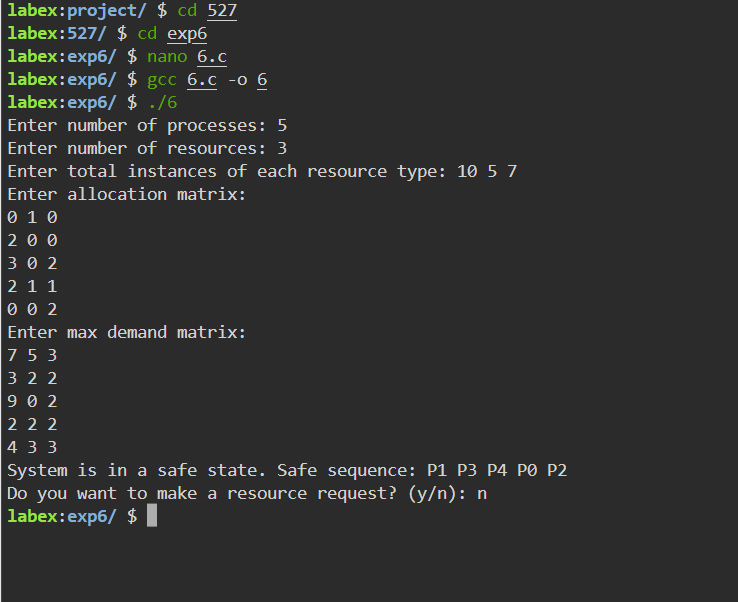

> ## Implement Bankers Algorithm for Dead Lock avoidance and prevention.
 ```c
#include <stdio.h>
#include <stdbool.h>

#define MAX_P 10 // Maximum number of processes
#define MAX_R 10 // Maximum number of resources

// Function to check if system is in a safe state
bool is_safe_state(int available[], int max_demand[][MAX_R], int allocation[][MAX_R], int P, int R) {
    int need[MAX_P][MAX_R], work[MAX_R], safe_sequence[MAX_P];
    bool finish[MAX_P] = {false};
    
    // Calculate Need matrix
    for (int i = 0; i < P; i++) {
        for (int j = 0; j < R; j++) {
            need[i][j] = max_demand[i][j] - allocation[i][j];
        }
    }
    
    // Initialize work with available resources
    for (int i = 0; i < R; i++) {
        work[i] = available[i];
    }
    
    int count = 0;
    while (count < P) {
        bool found = false;
        for (int i = 0; i < P; i++) {
            if (!finish[i]) {
                bool can_allocate = true;
                for (int j = 0; j < R; j++) {
                    if (need[i][j] > work[j]) {
                        can_allocate = false;
                        break;
                    }
                }
                if (can_allocate) {
                    for (int j = 0; j < R; j++) {
                        work[j] += allocation[i][j];
                    }
                    safe_sequence[count++] = i;
                    finish[i] = true;
                    found = true;
                }
            }
        }
        if (!found) {
            printf("System is in an unsafe state!\n");
            return false; // No safe sequence found, system is in an unsafe state
        }
    }
    
    // Print safe sequence
    printf("System is in a safe state. Safe sequence: ");
    for (int i = 0; i < P; i++) {
        printf("P%d ", safe_sequence[i]);
    }
    printf("\n");
    return true;
}

// Function to process a resource request
bool request_resources(int available[], int max_demand[][MAX_R], int allocation[][MAX_R], int P, int R) {
    int process_id, request[MAX_R];
    printf("Enter process ID making request: ");
    scanf("%d", &process_id);
    
    printf("Enter resource request for process P%d: ", process_id);
    for (int i = 0; i < R; i++) {
        scanf("%d", &request[i]);
    }
    
    // Check if request is valid
    for (int i = 0; i < R; i++) {
        if (request[i] > (max_demand[process_id][i] - allocation[process_id][i])) {
            printf("Error: Process has exceeded its maximum claim!\n");
            return false;
        }
        if (request[i] > available[i]) {
            printf("Resources are not available at the moment. Process P%d must wait.\n", process_id);
            return false;
        }
    }
    
    // Tentatively allocate requested resources
    for (int i = 0; i < R; i++) {
        available[i] -= request[i];
        allocation[process_id][i] += request[i];
    }
    
    // Check if new state is safe
    if (is_safe_state(available, max_demand, allocation, P, R)) {
        printf("Request granted to process P%d.\n", process_id);
        return true;
    } else {
        // Rollback if unsafe
        printf("Request denied as it leads to an unsafe state. Rolling back allocation.\n");
        for (int i = 0; i < R; i++) {
            available[i] += request[i];
            allocation[process_id][i] -= request[i];
        }
        return false;
    }
}

int main() {
    int P, R;
    printf("Enter number of processes: ");
    scanf("%d", &P);
    printf("Enter number of resources: ");
    scanf("%d", &R);
    
    int instances[MAX_R], available[MAX_R], max_demand[MAX_P][MAX_R], allocation[MAX_P][MAX_R];
    
    printf("Enter total instances of each resource type: ");
    for (int i = 0; i < R; i++) {
        scanf("%d", &instances[i]);
    }
    
    printf("Enter allocation matrix:\n");
    for (int i = 0; i < P; i++) {
        for (int j = 0; j < R; j++) {
            scanf("%d", &allocation[i][j]);
        }
    }
    
    printf("Enter max demand matrix:\n");
    for (int i = 0; i < P; i++) {
        for (int j = 0; j < R; j++) {
            scanf("%d", &max_demand[i][j]);
        }
    }
    
    // Calculate available resources
    for (int j = 0; j < R; j++) {
        int sum_alloc = 0;
        for (int i = 0; i < P; i++) {
            sum_alloc += allocation[i][j];
        }
        available[j] = instances[j] - sum_alloc;
    }
    
    is_safe_state(available, max_demand, allocation, P, R);
    
    // Process resource requests
    char choice;
    while (1) {
        printf("Do you want to make a resource request? (y/n): ");
        scanf(" %c", &choice);
        if (choice == 'n' || choice == 'N') {
            break;
        }
        request_resources(available, max_demand, allocation, P, R);
    }
    
    return 0;
}
```

