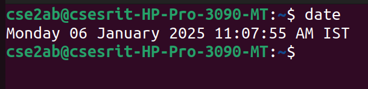
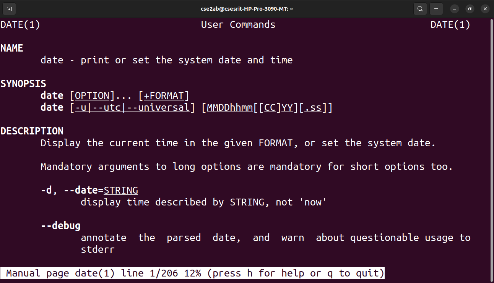
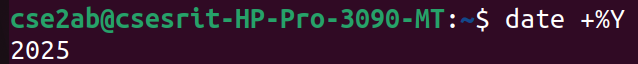
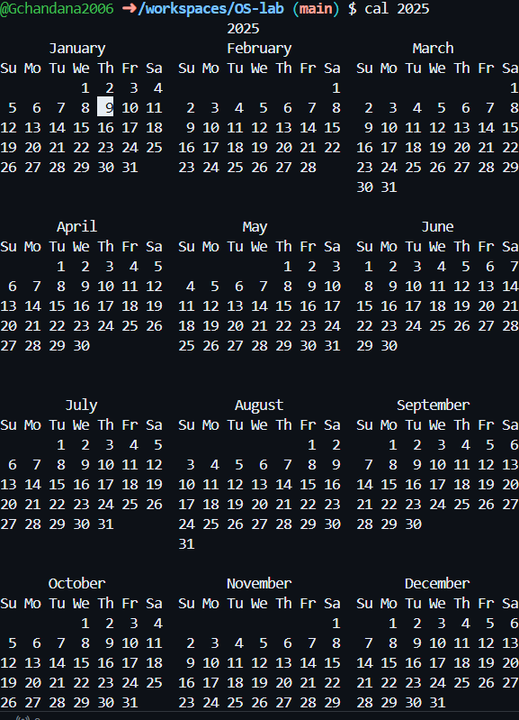
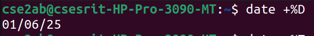
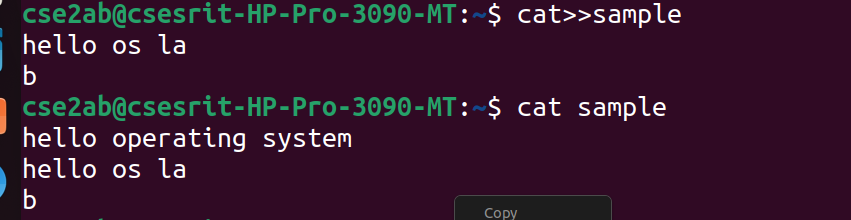

#os-lab
operating system lab
#basic linux practice
##general command outputs
### date command output

### year command output

### cal command output

### dateonly command output

### displayconte command output

###appenddat command output

### cotentinfile command output

